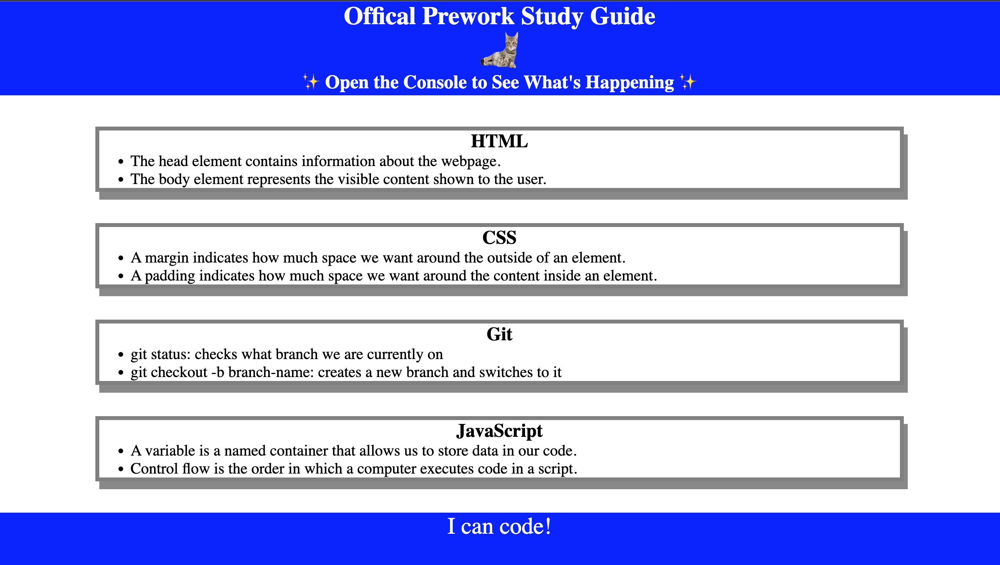

# <Your-Project-Title>

## Description

Provide a short description explaining the what, why, and how of your project. Use the following questions as a guide:

- the of purpose of this project was to learn: how to use different commands in the terminal; basic function of: HTML, CSS, Js. Practice reading instructions and completing the task.
- I built this project to test my ability of following directions, coding and time management.
- by doing this project it solved my anxiety fear of not being able to complete a coding project. I learn coding is pretty cool even though some debuging can take hours. it is a nice feeling of achivement onces fixed.

## Table of Contents (Optional)

If your README is long, add a table of contents to make it easy for users to find what they need.

- [Installation](#installation)
- [Usage](#usage)
- [Credits](#credits)
- [License](#license)

## Installation

1. clone from github
2. cl git pull command to make sure you have all updated files
3. open index.html with a browser

## Usage

## Credits

To University of richmond coding bootcamp for providing infomation and insuctions related to the project.

## License

MIT License

Copyright (c) [2022] [preworkout-study-guide]

Permission is hereby granted, free of charge, to any person obtaining a copy
of this software and associated documentation files (the "preworkout-study-guide"), to deal
in the Software without restriction, including without limitation the rights
to use, copy, modify, merge, publish, distribute, sublicense, and/or sell
copies of the Software, and to permit persons to whom the Software is
furnished to do so, subject to the following conditions:

The above copyright notice and this permission notice shall be included in all
copies or substantial portions of the Software.

THE SOFTWARE IS PROVIDED "AS IS", WITHOUT WARRANTY OF ANY KIND, EXPRESS OR
IMPLIED, INCLUDING BUT NOT LIMITED TO THE WARRANTIES OF MERCHANTABILITY,
FITNESS FOR A PARTICULAR PURPOSE AND NONINFRINGEMENT. IN NO EVENT SHALL THE
AUTHORS OR COPYRIGHT HOLDERS BE LIABLE FOR ANY CLAIM, DAMAGES OR OTHER
LIABILITY, WHETHER IN AN ACTION OF CONTRACT, TORT OR OTHERWISE, ARISING FROM,
OUT OF OR IN CONNECTION WITH THE SOFTWARE OR THE USE OR OTHER DEALINGS IN THE
SOFTWARE.

